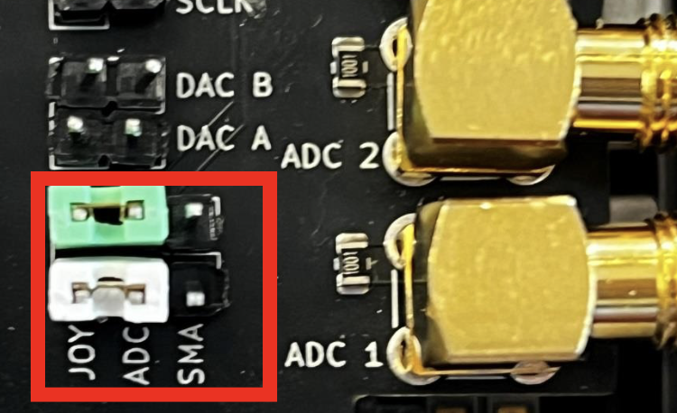
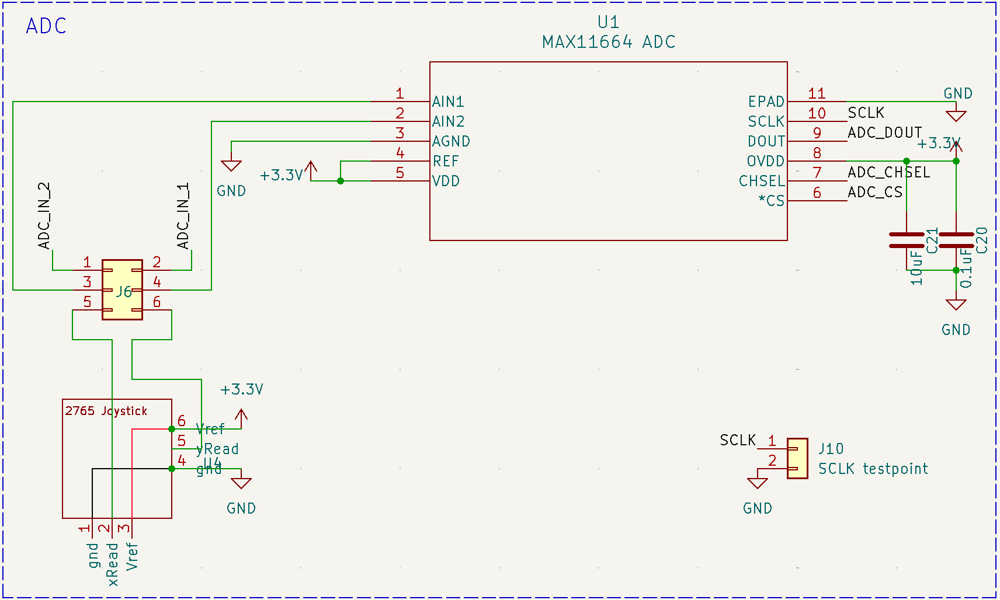

# Maxim MAX11664 Low-Power 10-Bit ADC

The MAX11664 ADC integrated into the peripheral shield provides high-resolution analog-to-digital conversion, making it ideal for applications requiring precise signal processing. With its 10-bit resolution and sampling rate of up to 500ksps, the MAX11664 ensures accurate and efficient conversion of analog signals into digital data for FPGA-based applications. 

The ADC features dual single-ended analog inputs connected via SMA ports, as well as a potentiometer joystick for generating analog signals. Users can select the input source using a jumper-based configuration mechanism. The 3x2 jumper header on the shield determines the ADC input channel and source according to the table: 

<table style="border-collapse: collapse;">
  <tr>
    <td style="border: 1px solid #ccc;">Joystick Input</td>
    <td style="border: 1px solid #ccc;">ADC Input CH1</td>
    <td style="border: 1px solid #ccc;">SMA Input ADC 1</td>
  </tr>
  <tr>
    <td style="border: 1px solid #ccc;">Joystick Input</td>
    <td style="border: 1px solid #ccc;">ADC Input CH2</td>
    <td style="border: 1px solid #ccc;">SMA Input ADC 2</td>
  </tr>
</table>

| Peripheral | DE10-Lite Port |
|------------|----------------|
| SCLK       | PIN_AA7        |
| ADC_CS     | PIN_AA8        |
| ADC_CHSEL  | PIN_AA9        |
| ADC_DOUT   | PIN_AB10       |

<!-- insert pdf here -->
<object data="../assets/datasheets/MAX11664_adc.pdf" type="application/pdf" width="100%" height="800px">
    <embed src="../assets/datasheets/MAX11664_adc.pdf" type="application/pdf" width="100%" height="800px">
</object>

[MAX11664 Datasheet](https://www.analog.com/media/en/technical-documentation/data-sheets/MAX11661-MAX11666.pdf)