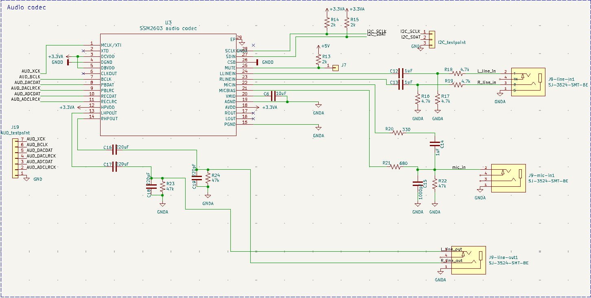
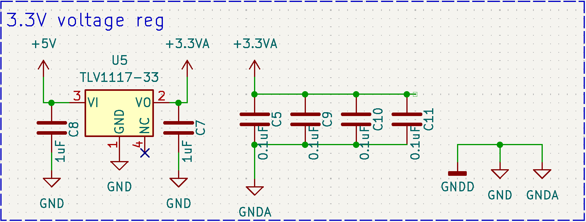

# Analog Devices SSM2603 Low Power Audio Codec

The SSM2603 audio codec integrated into the peripheral shield is a low-power stereo codec designed for applications requiring audio signal processing. The codec is equipped with three audio jack lines on the board: 

 - **Line In:** For external audio input. 
 - **Line Out:** For audio output to external devices. 
 - **Mic In:** For connecting a microphone. 

Additionally, the codec features an exposed pin for the mute signal, allowing users to control audio output directly. Test points for all codec signals are provided next to the IC, enabling users to connect wires and observe signal behavior during operation. The codec is configured via an I2C interface, which is hard-wired on the PCB. Test points for the I2C signals are also available for monitoring communication. 

To ensure optimal performance and minimize noise interference, the codec is powered through an isolated power line. The shield utilizes the 5V pin on the DE10-Lite board's GPIO header, which is converted to 3.3V using a TLV1117LV3-3 linear regulator, as recommended by the manufacturer. 

| Peripheral   | DE10-Lite port |
|-------------|----------------|
| I2C_SCLK    | PIN_AA14       |
| I2C_SDAT    | PIN_W12        |
| AUD_XCK     | PIN_W5         |
| AUD_BCLK    | PIN_W6         |
| AUD_DACDAT  | PIN_V7         |
| AUD_DACLRCK | PIN_V8         |
| AUD_ADCDAT  | PIN_V9         |
| AUD_ADCLRCK | PIN_V10        |

<!-- insert pdf here -->
<object data="../assets/datasheets/SSM2603_codec.pdf" type="application/pdf" width="100%" height="800px">
    <embed src="../assets/datasheets/SSM2603_codec.pdf" type="application/pdf" width="100%" height="800px">
</object>

