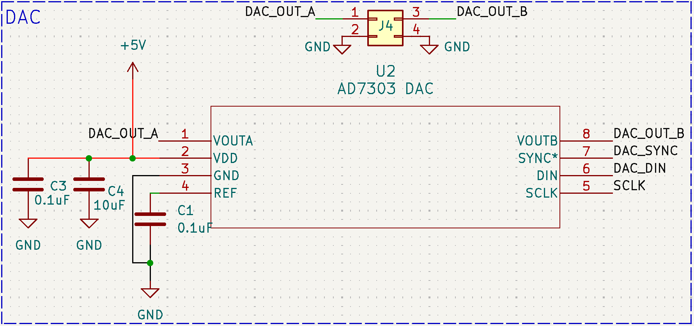

# Analog Devices AD7303 Dual Voltage Output 8-Bit DAC

The AD7303 DAC integrated into the peripheral shield is a dual-channel, 8-bit voltage-output device designed for precise digital-to-analog conversion. With its rail-to-rail output capability and low power consumption, the AD7303 is ideal for applications requiring efficient signal generation and processing. 

The DAC features two SMA connectors, each corresponding to one of its output channels. These connectors allow users to interface with external devices or measurement equipment seamlessly. The AD7303 operates from a 3.3V GPIO pin and is wired for SPI communication. 

| Peripheral | DE10-Lite port |
|------------|----------------|
| SCLK       | PIN_AA7        |
| DAC_SYNC   | PIN_AA5        |
| DAC_DIN    | PIN_AA6        |

<!-- insert pdf here -->
<object data="../assets/datasheets/AD7303_dac.pdf" type="application/pdf" width="100%" height="800px">
    <embed src="../assets/datasheets/AD7303_dac.pdf" type="application/pdf" width="100%" height="800px">
</object>