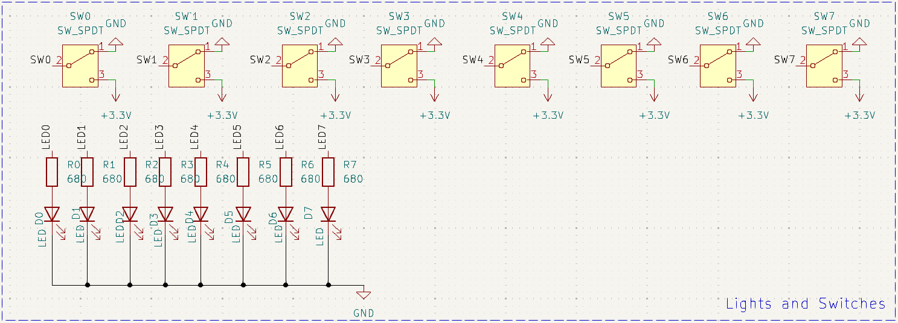
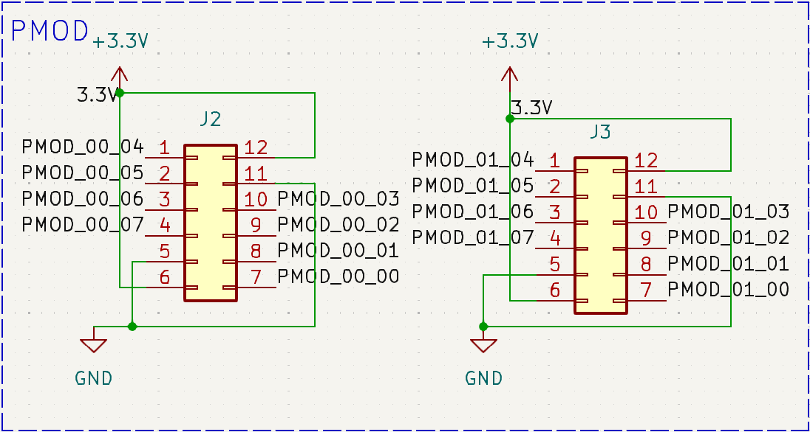
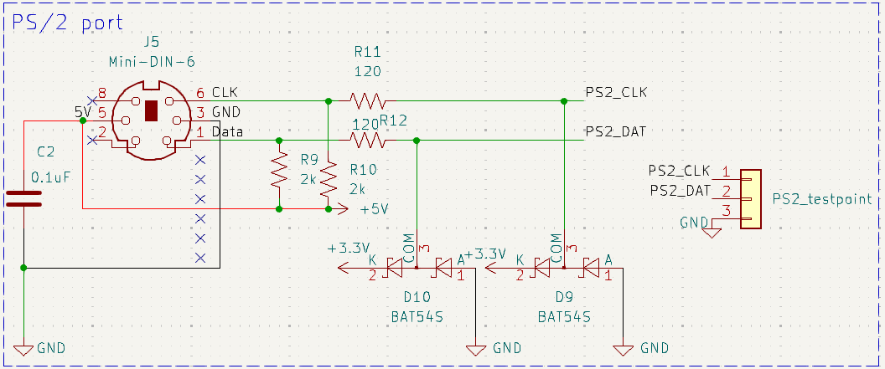
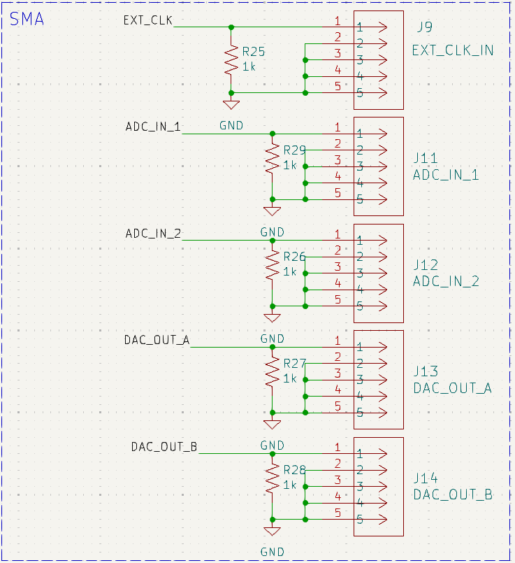
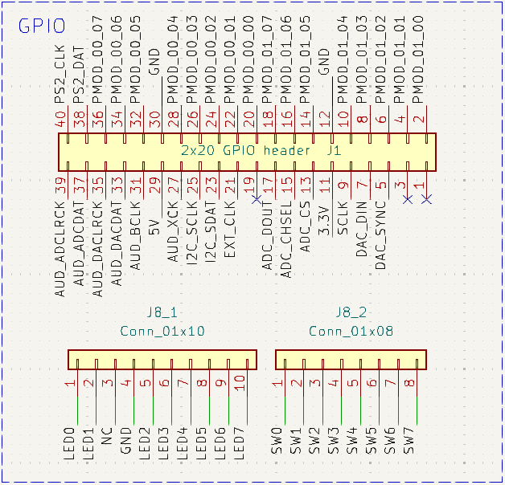

# Other Peripherals

## LEDs and Switches 

The peripheral shield is equipped with additional LEDs and toggle switches to complement the existing on-board peripherals and expand the overall input/output (I/O) capabilities of the DE10-Lite platform. 

| Peripheral | DE10-Lite Port |
|------------|----------------|
| LED1       | PIN_AB17       |
| LED2       | PIN_AA17       |
| LED3       | PIN_AB19       |
| LED4       | PIN_AA19       |
| LED5       | PIN_Y19        |
| LED6       | PIN_AB20       |
| LED7       | PIN_AB21       |
| LED8       | PIN_AA20       |
| SW8        | PIN_AA12       |
| SW7        | PIN_AA11       |
| SW6        | PIN_Y10        |
| SW5        | PIN_AB9        |
| SW4        | PIN_AB8        |
| SW3        | PIN_AB7        |
| SW2        | PIN_AB6        |
| SW1        | PIN_AB5        |

## PMOD Expansion Pins 

The peripheral shield includes two PMOD headers following the Digilent interface standard. These headers can be used with applicable PMOD modules to expand functionality. The PMOD pins are pass-through GPIO connections to the FPGA and can also function as general-purpose I/O. Information on official Digilent PMOD modules can be found [here](https://digilent.com/shop/products/fpga-boards/expansion-modules/pmods/).

| Peripheral   | DE10-Lite Port |
|--------------|----------------|
| PMOD_00_00   | PIN_W11        |
| PMOD_00_01   | PIN_Y11        |
| PMOD_00_02   | PIN_AB13       |
| PMOD_00_03   | PIN_W13        |
| PMOD_00_04   | PIN_AA15       |
| PMOD_00_05   | PIN_V5         |
| PMOD_00_06   | PIN_W7         |
| PMOD_00_07   | PIN_W8         |
| PMOD_01_00   | PIN_AA2        |
| PMOD_01_01   | PIN_Y3         |
| PMOD_01_02   | PIN_Y4         |
| PMOD_01_03   | PIN_Y5         |
| PMOD_01_04   | PIN_Y6         |
| PMOD_01_05   | PIN_Y7         |
| PMOD_01_06   | PIN_Y8         |
| PMOD_01_07   | PIN_AA10       |

## PS/2 Port 

The peripheral shield includes a PS/2 port, providing support for connecting PS/2-compatible keyboards or mice directly to the FPGA. This simple serial interface allows users to receive input data from these devices during lab experiments or project development. 

| Peripheral | DE10-Lite Port |
|------------|----------------|
| PS2_CLK    | PIN_W10        |
| PS2_DAT    | PIN_W9         |

## SMA Ports 

The peripheral shield includes SMA connectors for input and output of analog signals in conjunction with the ADC and DAC. The board also includes an SMA connector for an external clock input. 

| Peripheral | DE10-Lite Port |
|------------|----------------|
| EXT_CLK    | PIN_AB12       |

## GPIO Connectors

The physical pinout of the 2x20 GPIO connector and the 1x18 Arduino header is shown below:

